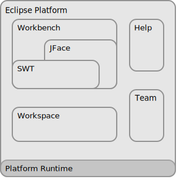

# 🌐 Обзор платформы Eclipse  
> 🔗 [Оригинал: Eclipse Platform Overview](https://help.eclipse.org/latest/index.jsp)

Платформа **Eclipse** организована в виде подсистем, реализованных в одном или нескольких плагинах. Эти подсистемы построены на основе небольшого runtime-движка. На рисунке ниже показан упрощённый вид:

**Платформа + группа плагинов, расширяющих её функционал**

---

## 🧰 Workbench (Рабочее пространство)

Термином **Workbench** обозначается рабочее пространство на десктопе. Оно организовано так, чтобы обеспечить бесшовную интеграцию всех инструментов, а также контролируемый доступ к функциям IDE благодаря единому подходу к созданию, управлению ресурсами и навигации по ним.

Каждое окно **Workbench** содержит одну или несколько **Перспектив (Perspectives)** — заранее настроенных наборов **Представлений (Views)** и **Редакторов (Editors)**, которые определяют, какие элементы будут отображаться в меню и на панели инструментов.  
Одновременно на рабочем столе можно открыть несколько окон Workbench.

---

## 🔗 Связанные понятия

- [Функции (Features)](../../features.md) ⚪  
- [Ресурсы (Resources)](../../resources.md) ⚪  
- [Перспективы (Perspectives)](perspective.md) ⚪  
- [Представления (Views)](view.md) ⚪  
- [Редакторы (Editors)](editor.md) ⚪  

---

## 🛠 Связанные задачи

- [Установка нового ПО (Installing new software)](../../tasks/install-software.md) ⚪  
- [Открытие перспектив (Opening perspectives)](../../tasks/open-perspective.md) ⚪  
- [Открытие представлений (Opening views)](../../tasks/open-view.md) ⚪  
- [Переключение между перспективами (Switching between perspectives)](../../tasks/switch-perspective.md) ⚪  
- [Отображение и скрытие элементов меню и панели инструментов (Showing and hiding menu items and toolbar buttons)](../../tasks/show-hide-menu-toolbar.md) ⚪  
- [Настройка групп команд перспективы (Configuring perspective command groups)](../../tasks/configure-command-groups.md) ⚪  
- [Настройка ярлыков перспективы (Configuring perspective shortcuts)](../../tasks/configure-shortcuts.md) ⚪  

---

## 📚 Справочные материалы

- [Кнопки панели инструментов (Toolbar buttons)](../../reference/toolbar-buttons.md) ⚪  